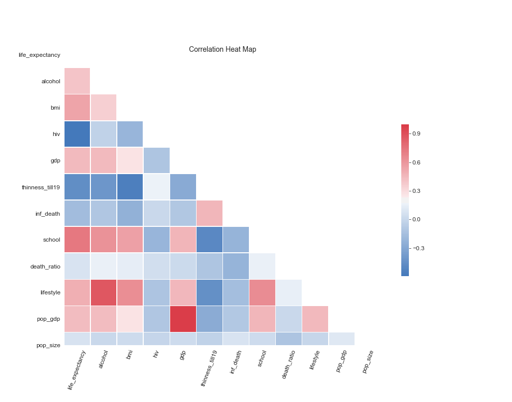

# Life Expectancy

In this project, we perform multiple linear regression to find the key features that affect life expectancy in different countries.
The overhead goal for this project is to find _which public health factors have the most significant impact on life expectancy in different countries_.

## Workflow

* Explore the Dataset
  * [Add Features](#new-features)
  * [Clean the Dataset](#cleaning-the-data)
* [Create Models](#results)
* [Test Models](#train-test-split)
* [Recommendation](#take-home-message)

## Data Sources

The dataset was was collected from "WHO" and the United Nations website by Deeksha Russell and Duan Wang and is now stored on [Kaggle](https://www.kaggle.com/kumarajarshi/life-expectancy-who "Kaggle"). It contains 2939 observations about different countries between the years 2000 and 2015.

| Data                     | Data                             | Data                            |
| ------------------------ | -------------------------------- | ------------------------------- |
| Country                  | HIV\AIDS                         | Measles                         |
| Year                     | Hepatitis B                      | BMI                             |
| Life expectancy          | Polio                            | Status                          |
| Adult mortality          | Diphtheria                       | Prevalence for malnutrition 5-9 |
| Infant mortality         | GDP                              | Education                       |
| Alcohol consumpton       | Population                       | Total expenditre on health      |
| Expenditre on health (%) | Prevalence for malnutrition 1-19 |

## Technical Description

To achieve the goal we utilized, [Pandas](https://pandas.pydata.org/pandas-docs/stable/index.html/ "Pandas") to clean and explore the data. Additionally, we used [Numpy](https://www.numpy.org/ "Numpy"), [Scipy](https://www.numpy.org/ "Scipy"), and [Sklearn](https://scikit-learn.org/stable/ "Sklearn") for data analysis.

To increase collaboration efficiency we created a [GitHub](https://github.com/DaggerForce/Life_Expectancy_Project/ "GitHub") repository; this allowed us to work uninterrupted, simultaneously, and independently.

The majority of our code was written in Jupyter Notebooks using Python. Furthermore, we used [VSCode](https://code.visualstudio.com/ "VSCode") to a module that contains our helper functions

### New Features
Initially, we assessed which predictors could have the greatest influence on life expectancy from our dataset. Additionally, we created 4 more features that we suspected could affect life expectancy.

1. Population Size - We divided our countries into three catagories; Small, Medium, and Large.
2. Lifestyle - We created an interaction between alcohol consumption and BMI
3. Economy - The interaction between the population and the GDP.
4. Death ratio - The ratio between adult and infant mortality.

### Cleaning the Data

We began by removing all the fragmented observations from the dataset. We then checked for a possible relationship between life expectancy and all of the different features. After picking the features we wanted to include, we transformed some of them; to achieve a more linear relationship and a more normally distributed data.

We proceeded by searching for multicollinearity between the selected predictors by creating a correlation matrix. We defined multicollinearity cut-off at 0.8 and omitted alcohol consumption and GDP from the initial model.

We then proceeded to remove possible outliers by looking at their scatter plots and removed the observations we deemed as unusual. After removing the outliers, 1635 observations remained in the dataset.

## Results

The first model we ran to predict life expectancy used the features; BMI, HIV, thinness 1-19, GDP, mortality ratio, lifestyle, education, infant mortality rate, economy, and population size. With R squared equal to 0.804, our initial model explains 80%~ of variation in life expectancy.

We ran the model again after scaling the data, and also removing predictors that were deemed insignificant (P-value > 0.05).

To test the model, we looked at the distribution of residuals for homoscedasticity. However, the residuals show a relationship. The heteroscedasticity is likely to have caused due to one or more of the predictors' distribution is skewed.

We conducted a train, test split test using 80% of our data to predict the other 20%. The model's mean absolute error is 3.022

### Train Test Split
Additionally, we tested the model with all the features we previously excluded (BMI, alcohol, GDP, and population size). Expectedly, the model mean absolute error is slightly smaller (2.995). However, the deviation is still in years meaning the model has to be refined.

## Take Home Message

Our suggestions for countries looking to increase their life expectancy is to focus their resources mainly towards increasing HIV awareness. Additionally, we recommend increasing promoting education and to invest more in hospital maternity wards.
