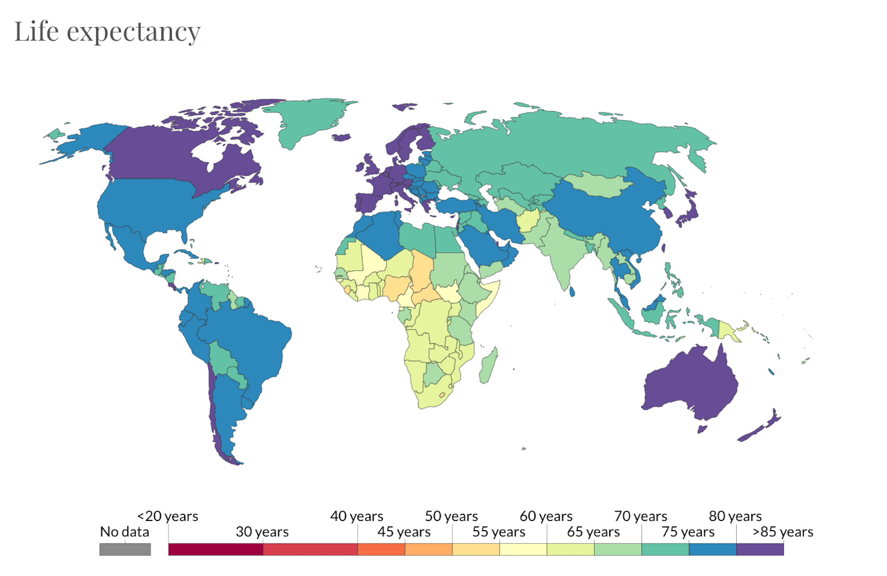

# Which Public Health Factors have the Greatest Impact on Life Expectancy?
#### Multivariate Linear Regression Analysis on Public Health Factors influencing Global Life Expectancy

### Background Information: 
Life expectancy is the key metric for assessing population health. It tells us the average age of death in a population. Estimates suggest that in a pre-modern, poor world, life expectancy was 30 years in all regions of the world. Since 1900 the global average life expectancy has more than doubled and is now above 70 years. The inequality of life expectancy is still very large across countries. More recently the country with the lowest life expectancy is the Central African Republic at 53 years while in Japan life expectancy is 30 years greater.

### Project Description and Motivaton:
Life expectancy is the average number of years that a group of persons in a population is expected to live. The intent of this project was to get a better understanding of the relationship between various public health factors and global life expectancy. How can countries better allocate their limited resources to improve their overall life expectancy. To answer that question multiple linear regression model were created and then evaluated to determine best fit. 

## Workflow

* Explore the Dataset
  * [Add Features](#new-features)
  * [Clean the Dataset](#cleaning-the-data)
* [Create Models](#results)
* [Evaluating Models](#train-test-split)
* [Recommendations](#take-home-message)

## Data Sources

The Global Health Observatory (GHO) data repository under World Health Organization (WHO) keeps track of the health status as well as many other related factors for all countries. The final dataset contains 2939 observations where each row represents a country for a specific year. There are a total of 193 countries with data from years 2000 to 2015. The features include immunization factors, mortality factors, economic factors, social factors and other health related factors.

| Features include:        |                                  |                                 |
| ------------------------ | -------------------------------- | ------------------------------- |
| Country                  | HIV\AIDS                         | Measles                         |
| Year                     | Hepatitis B                      | BMI                             |
| Life expectancy          | Polio                            | Status                          |
| Adult mortality          | Diphtheria                       | Prevalence for malnutrition 5-9 |
| Infant mortality         | GDP                              | Education                       |
| Alcohol consumpton       | Population                       | Total expenditure on health     |
| Expenditure on health (%)| Prevalence for malnutrition 1-19 |

## Technical Description

To achieve the goal we utilized various Python libraries such as [Pandas](https://pandas.pydata.org/pandas-docs/stable/index.html/ "Pandas") to clean and explore the data. [Numpy](https://www.numpy.org/ "Numpy"), [Scipy](https://www.numpy.org/ "Scipy"), and [Sklearn](https://scikit-learn.org/stable/ "Sklearn") for data analysis, descriptive statistics and modeling.

### New Features
Initially for the baseline model, literature review and domain knowledge was used to select which predictors could have the greatest influence on life expectancy. Additionally, 4 more features were created that could effect life expectancy and better explain the data. These 4 engineered features are:  

1. Population Size - A population range was created which includes three catagories; Small, Medium, and Large.
2. Lifestyle - We created an interaction variable that takes alcohol consumption and BMI into consideration. 
3. Economy - A interaction variable between population and the gross domestic product (GDP).
4. Death ratio - The ratio between adult and infant mortality.

### Cleaning the Data

First, all the fragmented observations from the dataset were removed. In order to see if the data met the linearity model assumption scatter plots were generated for each predictor with the target variable and assessed. When necessary, certain features were transformed to achieve a more linear relationship and normal distribution.

Next, the multicollinearity model assumption was assessed between the selected predictors by creating a correlation heat-map. A multicollinearity threshold was assigned at 0.8 and variables above the threshold were cut off.

After that, all possible cases of outliers were assessed by looking at box-whisker plots and scatter plots. Extreme observations that were skewing the data were removed.

## Results

The first model to predict life expectancy used the features; BMI, HIV, thinness 1–19, GDP, mortality ratio, lifestyle, education, infant mortality rate, economy, and population size. With the R squared equal to 0.804. In other words, the initial model explains 80% of variation in life expectancy (when compared to the mean line).

Another model was built in which the data was scaled and insignificant predictors (p-value > .05) from the baseline model were removed. Since various features have different units of measurement and the data has been transformed to meet model assumptions, scaling the data allows results to be more comparable and interpretable.

To test the model for another linear regression model assumption, the distribution of residuals for homoscedasticity was evaluated. The residuals although scattered did suggest a minor positive linear relationship. This heteroscedasticity is likely to due predictor variable distribution being skewed or there might be missing features that the dataset does not have information on.

We conducted a train, test split test using 80% of our data to to train the model and predict on the other 20%. The model's mean absolute error was 3.022

### Train Test Split
Additionally, we tested the model with all the features we previously excluded (BMI, alcohol, GDP, and population size). The model mean absolute error slightly improved to 2.995.

## Conclusion

A suggestion for countries looking to increase their global life expectancy is to focus their resources mainly on program and policies that increase HIV awareness and prevention. It's interesting to see that although the research and maintenance of HIV has increased it is still a major burden in developing nations. 
Additionally, another suggestion would be for countries to develop more policies and allocate more resources that increase access to education. It’s important to note are countries not giving priority to education or do they not have enough resources to provide more education? Are these countries too focused on survival to the point that more education is secondary?
A possible next step would be to separate developing and established countries as the public health factors effecting each type may be very different. Developing nations still lack fundamental resources while established nations may have completely different issues such as cardiovascular disease and cancer (more data!).
